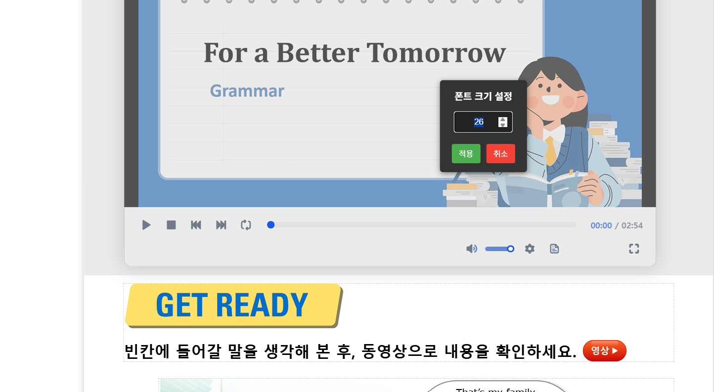
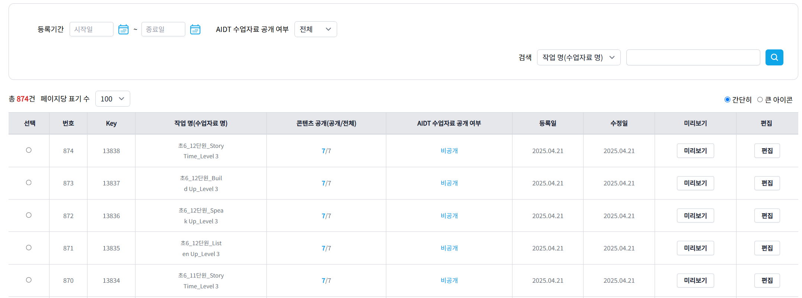
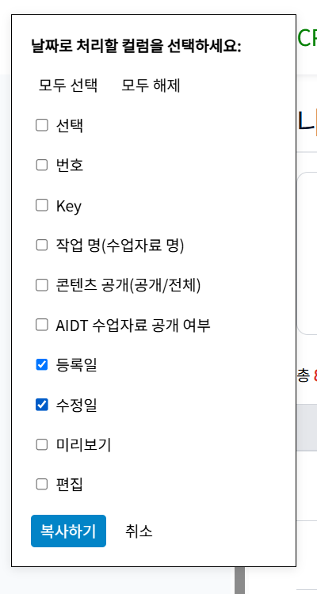
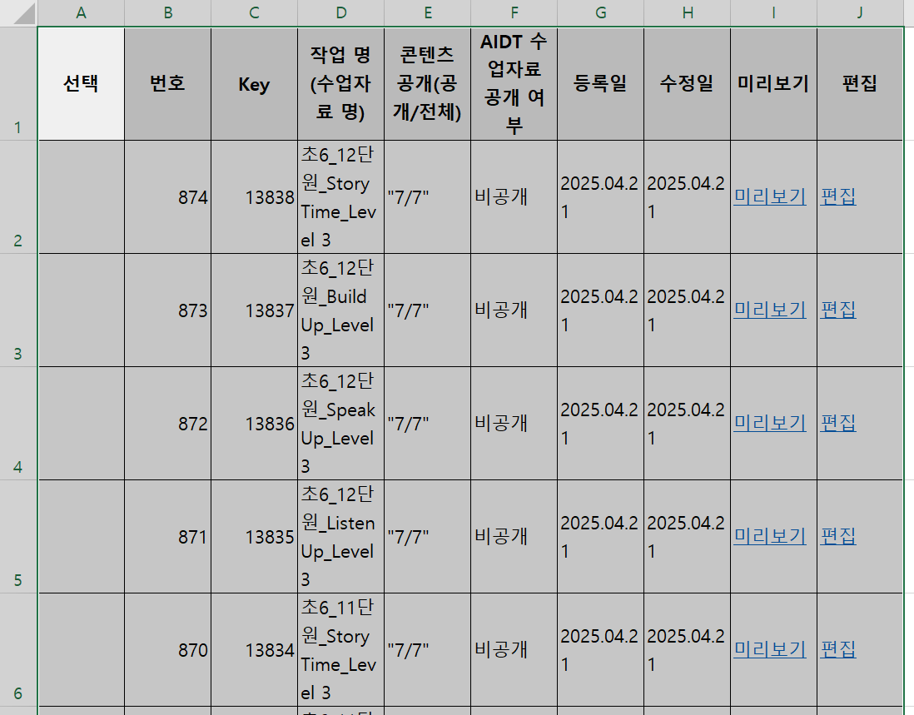

# 🚀 업무 효율성 극대화를 위한 자체 개발 도구 모음

안녕하세요! 저는 업무 생산성과 효율성을 높이기 위해 직접 개발한 확장 프로그램 및 응용 프로그램들을 공유하고자 합니다. 저와 저희 팀원들이 실제로 사용하며 효과를 보고 있는 도구들이니, 여러분의 업무에도 도움이 되기를 바랍니다.

---

## 1. 글꼴꼴꼴 (Chrome 확장 프로그램)

CBS 환경에서 **키보드 단축키**만으로 글꼴과 글꼴 크기를 신속하게 조절할 수 있게 도와주는 확장 프로그램입니다. 마우스로 일일이 설정해야 하는 번거로움을 없애고 문서 편집 작업의 생산성을 크게 향상시킵니다.

---

## 2. 영상 자막 편집기 (Chrome 확장 프로그램)

영상 콘텐츠 제작자를 위한 직관적인 **비디오 자막 편집 도구**입니다. CBS 세트지 내 영상에 맞춰 자막을 손쉽게 추가하고 편집할 수 있습니다.

-   **정확한 타임스탬프 편집:** 오디오 파형 시각화 기능으로 음성 구간을 정확히 파악하고 자막 싱크를 맞출 수 있습니다.
-   **편리한 단축키:** 스페이스바로 재생/일시정지, Ctrl+화살표로 0.1초 단위 이동 등 키보드 단축키를 지원하여 정밀하고 빠른 작업이 가능합니다.
-   **다중 파일 및 언어 지원:** 여러 동영상을 탭으로 관리하고, 한국어와 영어 자막을 동시에 편집할 수 있습니다.

---

## 3. 따옴표 고데기 (Chrome 확장 프로그램)

웹 에디터에서 일반 따옴표 (`'`, `"`)를 **스마트 따옴표** (`‘`, `'`, `“`, `”`)로 자동으로 변환해주는 확장 프로그램입니다. CBS 세트지 등 전문적인 글쓰기 환경에서 요구되는 올바른 따옴표 사용을 도와줍니다.

-   **문맥 인식 변환:** 축약형, 소유격, 시간 표현 등 다양한 문맥을 이해하여 정확하게 변환합니다.
-   **가독성 및 전문성 향상:** 텍스트를 더 깔끔하고 전문적으로 보이게 만들어 가독성을 높여줍니다.

---

## 4. CopyBuddies (Chrome 확장 프로그램)

웹 페이지의 HTML 테이블 데이터를 **엑셀(Excel)에서 바로 사용하기 좋은 형식**으로 변환하여 클립보드에 복사해주는 편리한 도구입니다. CBS 등에서 테이블 데이터를 공유 엑셀 시트로 옮기는 반복적인 수작업을 크게 줄여줍니다.

---

## 5. Check Brief Sound (Chrome 확장 프로그램)

CBS 세트지 저작 시 삽입된 **음원 정보를 시각적으로 명확하게 표시**하여 음원 검수 작업을 효율적으로 만들어주는 확장 프로그램입니다. 음원이 포함된 부분을 한눈에 파악하고 관리할 수 있어 검수 시간을 단축하고 정확도를 높입니다.

---

## 6. PDF Text Processor (응용 프로그램)

PDF 문서에서 필요한 **텍스트 영역만 선택(Crop)하여 엑셀 파일로 깔끔하게 추출**해주는 응용 프로그램입니다. PDF 내 텍스트 데이터를 다른 시스템이나 문서로 옮겨야 할 때 매우 유용하며, 데이터 이전 작업의 효율성을 크게 높여줍니다.

_(설치 링크나 실행 파일 정보가 있다면 여기에 추가해주세요.)_

_1.png>)
_2.png>)
_3.png>)

---

## 7. 영상/음원 자막 업로드 파일 생성기 (응용 프로그램)

영상 또는 음원 파일에서 **Whisper AI와 pyannote.audio와 같은 최신 AI 기술을 활용하여 자동으로 음성 구간을 탐지(세그먼트 추출) 및 텍스트 변환**하고, 이를 기반으로 **정확한 자막 타임라인 초안**을 생성해주는 응용 프로그램입니다.

-   **파형 기반 편집:** 음원 파형을 보면서 세그먼트를 직관적으로 수정하고 자막 싱크를 정밀하게 조절할 수 있습니다.
-   **CBS 호환:** 편집된 자막은 CBS 영상 자막 포맷과 호환되는 엑셀 파일로 내보낼 수 있어, 자막 업로드 과정을 간소화합니다.

_(설치 링크나 실행 파일 정보가 있다면 여기에 추가해주세요.)_

---

## 🤖 AI 기술 접목 및 활용 사례

이 도구 모음 개발 및 고도화 과정에서 최신 AI 기술이 다방면으로 활용되었습니다.

-   **영상/음원 자막 업로드 파일 생성기:** Whisper AI(음성 인식)와 pyannote.audio(화자 분리/음성 구간 탐지)를 직접 통합하여 자막 생성의 핵심 기능을 구현했습니다.
-   **기타 도구 고도화:** 다른 도구들의 기능을 개선하고 코드를 최적화하는 과정에서 거대 언어 모델(LLM)의 도움을 받아 개발 생산성을 높이고 아이디어를 구체화했습니다.
-   **자동화 및 효율 증대:** 반복적인 작업을 줄이고(예: 따옴표 변환, 테이블 복사), 데이터 추출 및 변환 과정을 자동화하는 데 AI 아이디어를 차용했습니다.

---

이 도구들이 여러분의 업무에 긍정적인 변화를 가져다주길 기대합니다!
